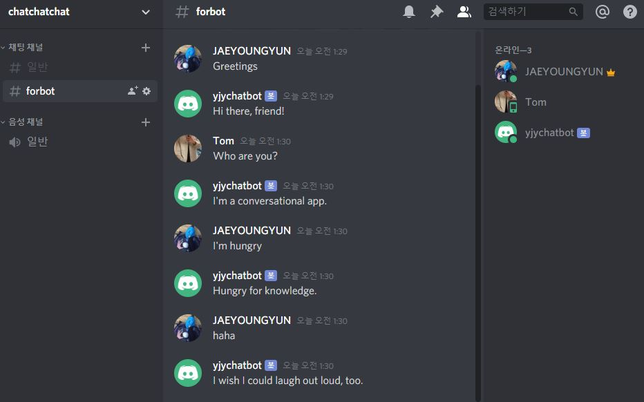

## Discord Chatbot

A simple discord chatbot using dialogflow.

For communicating with discord and dialogflow, you need to do the following steps.

- [Create a discord application as a bot](https://discordapp.com/developers/docs/intro)
- [Create a google project to use dialogflow api](https://cloud.google.com/dialogflow/docs/quick/setup)

The behavior and performance of your bot depends on the agent of your dialogflow.

## Dependencies

[Discord](https://discordapp.com/)

[Dialogflow](https://dialogflow.com/)

python

- [discord.py](https://discordpy.readthedocs.io/en/latest/)
- [dialogflow](https://dialogflow-python-client-v2.readthedocs.io/en/latest/)
- python_dotenv

